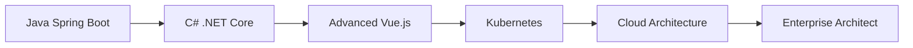

# 👋 Nahuel Nicolás Medina

## 🚀 Especialista en Desarrollo de Software & Arquitectura de Sistemas

[](https://www.linkedin.com/in/nahuelnmedina27890)
[](https://github.com/nahuelnmedina)

---

## 🎯 Acerca de mí

> **Desarrollador Fullstack** con **5+ años de experiencia** especializándome en **arquitectura de microservicios**, **integración de APIs** y **desarrollo enterprise**. Apasionado por crear soluciones escalables y robustas que resuelvan problemas del mundo real e impacten positivamente en los usuarios.

```javascript
const nahuel = {
  name: "Nahuel Nicolás Medina",
  role: "Fullstack Developer & Software Architect",
  experience: "5+ years",
  location: "Argentina 🇦🇷",
  currentFocus: ["Microservices", "Enterprise APIs", "System Architecture"],
  nextLearning: ["Java Spring Boot", "C# .NET Core", "Advanced Vue.js"]
};
```

**🎯 Mi expertise incluye:**
- 🏗️ Arquitectura de microservicios con **Node.js** y **Go**
- 🔗 Integración de sistemas complejos y APIs enterprise
- 🐳 Deployment con **Docker** en entornos **Linux** de producción
- 💳 Sistemas de pago y fintech (**MercadoPago**, **POSNET**)
- 🏥 Aplicaciones críticas para salud y gobierno

---

## 🛠️ Stack Tecnológico

### **Backend Development**


### **Frontend Development**


### **Databases & Storage**


### **DevOps & Infrastructure**


### **Message Queues & APIs**


### **🌱 Currently Learning (2025)**


---

## 💼 Experiencia Profesional

### 🏢 **EXO S.A.** | *Desarrollador Fullstack Senior*
**📅 Nov 2019 – Presente (5+ años)**

#### � Proyectos Destacados

<details>
<summary><strong>�🏦 Terminal de Pago Empresarial</strong></summary>

**Stack:** Node.js • Express • Vue.js • PostgreSQL • Docker • Linux

**🎯 Características principales:**
- 💳 Integración completa API MercadoPago (POSNET + QR)
- 🏗️ Arquitectura microservicios escalable y resiliente
- 🐳 Deployment automatizado con Docker y CI/CD
- 📊 Monitoring en tiempo real y logging enterprise
- 🔐 Security compliance para transacciones financieras

**📈 Logros e impacto:**
- ✅ Arquitectura que soporta 1000+ transacciones/día
- ✅ Code review de integraciones críticas de pago
- ✅ Zero downtime deployment pipeline implementado
- ✅ Reducción 60% tiempo de procesamiento vs sistema legacy
</details>

<details>
<summary><strong>🚗 Smart Parking System (Universidad)</strong></summary>

**Stack:** Node.js • PostgreSQL • Vue.js • MercadoPago API • IoT Integration

**🎯 Características principales:**
- 👥 Gestión completa de usuarios universitarios
- 💰 Sistema de pagos automáticos integrado
- 🚪 Control automatizado de barreras IoT
- 📱 Interface responsive y mobile-friendly
- 📊 Analytics y reporting de uso de espacios

**📈 Logros e impacto:**
- ✅ Sistema escalable para 1000+ usuarios concurrentes
- ✅ Performance optimization de queries SQL complejas
- ✅ Reducción 80% tiempo de gestión manual
- ✅ Optimización espacios universitarios con datos en tiempo real
</details>

<details>
<summary><strong>🏥 Sistema Monitoreo Hospitalario COVID-19</strong></summary>

**Stack:** Node.js • PostgreSQL • Docker • Linux • Real-time APIs

**🎯 Características principales:**
- 🏥 Monitoreo crítico en tiempo real 24/7
- 📊 Dashboard de métricas vitales y alertas
- 🔔 Sistema automatizado de notificaciones críticas
- 🔐 Cumplimiento estricto normativas sanitarias
- 📋 Audit trails y trazabilidad completa

**📈 Logros e impacto:**
- ✅ Deployed exitosamente en múltiples hospitales Formosa
- ✅ Monitoring sin interrupciones durante toda la pandemia
- ✅ Zero fallos críticos en sistema de salud esencial
- ✅ Contribución directa a respuesta sanitaria COVID-19
</details>

<details>
<summary><strong>📺 Cartelería Digital Gubernamental</strong></summary>

**Stack:** Node.js • Vue.js • PostgreSQL • Azure • Docker • Enterprise Security

**🎯 Características principales:**
- 🏛️ Sistema de comunicación masiva ciudadana
- 🔗 Integración compleja con sistemas legacy gubernamentales
- 🛡️ Security compliance y standards gubernamentales
- 📋 Audit trails y logging para transparencia
- 🌐 Distribución multimedia a escala masiva

**📈 Logros e impacto:**
- ✅ Cumplimiento 100% estándares gubernamentales
- ✅ Integración exitosa con múltiples sistemas legacy
- ✅ Deployed en infraestructura Azure enterprise
- ✅ Comunicación efectiva con miles de ciudadanos
</details>

---

## 📈 GitHub Stats & Performance

<div align="center">


</div>

---

## 🎯 Roadmap de Especialización 2025



### 🎯 **Objetivos Técnicos Q1-Q2 2025**

| Tecnología | Nivel Objetivo | Timeline | Estado | Recursos |
|------------|---------------|----------|---------|----------|
| **Java Spring Boot** | Production Ready | 8 semanas | 🟡 En progreso | Oracle Docs + Proyectos |
| **C# .NET Core** | Enterprise APIs | 6 semanas | 🟡 En progreso | Microsoft Learn |
| **Vue.js Advanced** | TypeScript + Testing | 4 semanas | 🟢 Avanzado | Vue Mastery |
| **Kubernetes** | Container Orchestration | 6 semanas | 🔴 Planificado | Hands-on Labs |
| **Enterprise Git** | Workflows + Code Review | Continuo | 🟢 Dominado | Experiencia diaria |

### 📊 **Progreso Current Skills**

```yaml
Backend Expertise:
  Node.js:          ████████████████████ 100% (5+ años)
  Go/Golang:        ████████████ 60% (3+ años)
  Python:           ████████ 40% (2+ años)
  Java:             ████ 20% (en desarrollo)
  C#:               ██ 10% (iniciando)

Frontend Skills:
  JavaScript:       ████████████████████ 100% (5+ años)
  Vue.js:           ███████████████ 75% (3+ años)
  TypeScript:       ████████████ 60% (2+ años)

DevOps & Infra:
  Docker:           ███████████████ 75% (3+ años)
  Linux:            ████████████████ 80% (4+ años)
  Git Workflows:    ████████████████████ 100% (5+ años)
  Azure:            ████████ 40% (2+ años)

Database:
  PostgreSQL:       ████████████████████ 100% (5+ años)
  MongoDB:          ████████████ 60% (2+ años)
```

---

## � Educación & Certificaciones

### 🎓 **Formación Académica**
- **Ingeniería Informática** - Universidad Nacional de Avellaneda *(En curso)*
- **Humanidades y Ciencias Sociales** - Escuela Normal Superior Antonio Mentruyt (2008)

### 🏆 **Certificaciones Profesionales**
- 🥇 **Certificación SCRUM & Kanban** - Metodologías Ágiles
- 🐳 **Docker Expertise** - Containerization y Enterprise Deployment
- 🔄 **RESTful API Design** - Best practices y documentación
- 🏗️ **Microservices Architecture** - Diseño e implementación

---

## �🏆 Logros y Fortalezas Destacadas

### 💪 **Fortalezas Técnicas**
- ✅ **Sistemas críticos en producción** durante pandemia COVID-19
- ✅ **Arquitectura microservicios** escalable con Go + Node.js en producción
- ✅ **Integración APIs complejas** (MercadoPago, sistemas legacy, enterprise)
- ✅ **Performance optimization** en aplicaciones de alto tráfico (1000+ usuarios)
- ✅ **Deployment automatizado** con Docker en Linux enterprise
- ✅ **Code review expertise** y quality assurance en proyectos críticos

### 🤝 **Competencias de Liderazgo**
- 🎯 **Arquitectura de Soluciones** - Diseño end-to-end de sistemas complejos
- 👥 **Team Collaboration** - Mentoring y knowledge sharing con developers junior
- 🔍 **Problem Solving** - Debug de sistemas críticos y troubleshooting avanzado
- 📚 **Technical Documentation** - APIs, arquitectura y best practices
- 🚀 **Innovation Drive** - Implementación de nuevas tecnologías y patterns

### � **Proyectos de Alto Impacto**
- 🏥 **COVID-19 Healthcare Response** - Sistemas críticos hospitalarios
- 🏛️ **Government Digital Transformation** - Compliance y security standards
- � **Fintech Solutions** - Integración segura de pagos y transacciones
- 🎓 **EdTech Innovation** - Soluciones universitarias escalables y automatizadas

---

## 🌐 Arquitecturas que Domino

### **Microservices Architecture Pattern**
```
┌─────────────┐    ┌─────────────┐    ┌─────────────┐
│   Gateway   │    │   Auth      │    │   Payment   │
│   (Node.js) │────│   Service   │────│   Service   │
└─────────────┘    │   (Go)      │    │   (Node.js) │
                   └─────────────┘    └─────────────┘
                          │                   │
                   ┌─────────────┐    ┌─────────────┐
                   │  PostgreSQL │    │   MongoDB   │
                   └─────────────┘    └─────────────┘
```

### **API Integration Expertise**
- 🔄 **RESTful APIs** con documentación OpenAPI/Swagger
- 🚀 **GraphQL** para queries optimizadas y flexible data fetching  
- 📡 **Message Queues** (MQTT, NATS) para comunicación asíncrona
- 🔐 **OAuth 2.0 & JWT** para autenticación y autorización enterprise
- 🏗️ **API Gateway Patterns** para routing y load balancing

---

## 🌱 Crecimiento Profesional Actual

### � **Actualmente Enfocado En:**
- 🎯 **Java Spring Boot** - Desarrollo enterprise y microservicios patterns
- 🏗️ **C# .NET Core** - APIs REST robustas y Entity Framework
- 🔧 **Advanced Vue.js** - TypeScript, testing avanzado y composition API
- 📖 **Enterprise Architecture** - Design patterns y system design at scale
- 👥 **Technical Leadership** - Code review, mentoring y team processes

### 🎯 **Objetivos de Carrera (2025-2027)**

**🏃‍♂️ Corto Plazo (6-12 meses):**
- Dominio completo **Java Spring Boot** + **C# .NET Core**
- Expertise en **TypeScript** y **advanced Vue.js patterns**
- Contribuciones significativas a **open source projects**

**🏃‍♂️ Mediano Plazo (1-2 años):**
- **Especialista Tecnología IT** en empresa líder tech
- **Tech Lead** en equipos de arquitectura enterprise
- **Technical Mentor** para desarrollo de talent junior

**🏃‍♂️ Largo Plazo (3+ años):**
- **Software Architect** especializado en cloud y microservicios
- **Technical Consultant** para digital transformation projects
- **Tech Speaker** en conferencias y community building

---

## 🌟 Portfolio & Proyectos Destacados

*🚧 En desarrollo: Portfolio open source demostrando expertise técnico*

### 🎯 **Próximos Proyectos GitHub (Q1 2025)**
- 🏗️ **Enterprise Microservices Demo** - Java Spring Boot + Docker orchestration
- 🚀 **Vue.js TypeScript Showcase** - Advanced patterns y testing framework
- 🔧 **DevOps Automation Suite** - CI/CD pipelines y infrastructure as code
- 📊 **System Architecture Documentation** - Diagramas y best practices guide

---

## 📫 Contacto & Colaboración

<div align="center">

### 💬 **¿Interesado en colaborar o conocer más sobre mi trabajo?**

> Especializado en **arquitecturas escalables**, **integración de APIs enterprise** y **desarrollo full-stack**. Siempre abierto a nuevos desafíos técnicos, proyectos innovadores y oportunidades de crecimiento profesional.

</div>

**🔗 Canales de contacto preferidos:**
- 💼 **LinkedIn:** [nahuelnmedina27890](https://www.linkedin.com/in/nahuelnmedina27890) - *Mejor para oportunidades profesionales*
- 📧 **Email:** [Nahuel.n2o@gmail.com](mailto:Nahuel.n2o@gmail.com) - *Proyectos y consultas técnicas*
- 📱 **WhatsApp:** [+54 1123974365](tel:+541123974365) - *Contacto directo*

**🤝 Disponible para:**
- 💼 **Posiciones Especialista Tecnología IT** y roles de liderazgo técnico
- 🔬 **Proyectos de consultoría** en arquitectura y modernización de sistemas
- 🎓 **Mentoring técnico** y transferencia de conocimiento a equipos
- 🚀 **Colaboraciones desafiantes** en proyectos open source o innovation labs

---

## 🎮 Fun Facts & Intereses

- 🌱 **Currently learning:** Java Spring Boot, C# .NET Core y advanced system design
- 🏥 **COVID-19 Hero:** Contribuí con sistemas críticos hospitalarios durante la pandemia
- 🚗 **IoT Enthusiast:** Fan de automatización y proyectos Smart City (Smart Parking)
- 📚 **Continuous Learner:** Siempre explorando nuevas arquitecturas cloud y patterns
- ☕ **Powered by:** Café de especialidad, microservicios bien diseñados y código limpio
- 🎯 **Philosophy:** *"La mejor tecnología es la que resuelve problemas reales de manera elegante"*

---

<div align="center">

### 🚀 *"Code is poetry written in logic"* 


**⭐ Si mi trabajo te resulta interesante, no olvides seguirme y darle estrella a mis repositorios!**

---

*Última actualización: Enero 2025 | Version 2.0*

</div>
